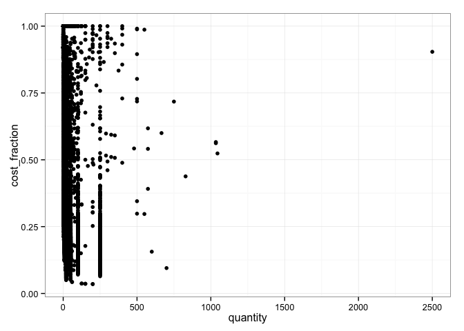
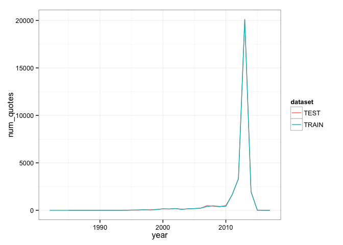
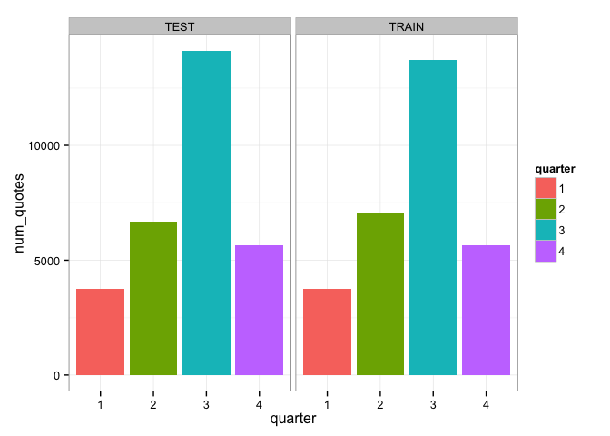
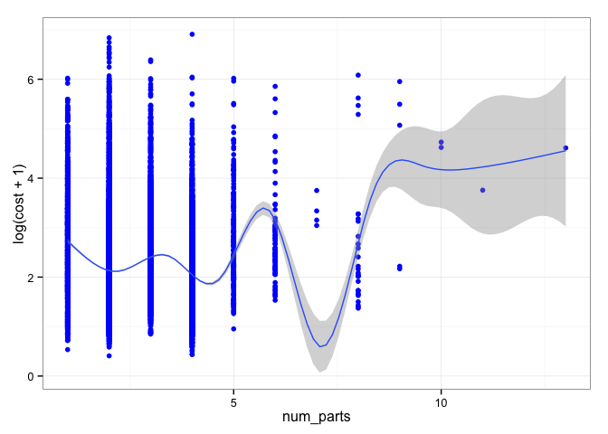
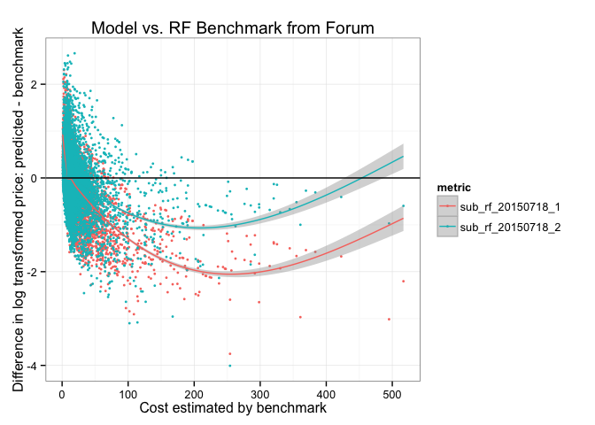

# Exploratory Analysis
Brad Dixon <rd729c@att.com>  
July 15, 2015  


# Primary Training Data


```r
DATA = bind_rows(
  mutate(train.set, dataset = "TRAIN", id = NA),
  mutate(test.set,  dataset = "TEST")
) %>% 
  mutate_each( funs(factor), tube_assembly_id, supplier, dataset) %>% 
  mutate( quote_date = ymd(quote_date))
```

```
## Warning in rbind_all(list(x, ...)): Unequal factor levels: coercing to
## character
```

```
## Warning in rbind_all(list(x, ...)): Unequal factor levels: coercing to
## character
```

```
## Warning in rbind_all(list(x, ...)): Unequal factor levels: coercing to
## character
```

```r
print(summary(DATA))
```

```
##  tube_assembly_id    supplier       quote_date                 
##  TA-04788:   14   S-0066 :41100   Min.   :1982-09-22 00:00:00  
##  TA-04027:   12   S-0041 : 6451   1st Qu.:2012-10-24 00:00:00  
##  TA-04750:   12   S-0072 : 4653   Median :2013-07-01 00:00:00  
##  TA-06069:   12   S-0054 : 1799   Mean   :2012-08-04 00:24:12  
##  TA-14402:   12   S-0026 : 1511   3rd Qu.:2013-09-01 00:00:00  
##  TA-04749:   11   S-0013 : 1166   Max.   :2017-01-01 00:00:00  
##  (Other) :60375   (Other): 3768                                
##   annual_usage     min_order_quantity bracket_pricing    quantity      
##  Min.   :      0   Min.   :   0.000   No : 7886       Min.   :   1.00  
##  1st Qu.:      0   1st Qu.:   0.000   Yes:52562       1st Qu.:   2.00  
##  Median :      0   Median :   0.000                   Median :  10.00  
##  Mean   :    186   Mean   :   2.191                   Mean   :  38.17  
##  3rd Qu.:      2   3rd Qu.:   0.000                   3rd Qu.:  40.00  
##  Max.   :3498645   Max.   :2500.000                   Max.   :2500.00  
##                                                                        
##       cost           dataset            id       
##  Min.   :   0.000   TEST :30235   Min.   :    1  
##  1st Qu.:   0.000   TRAIN:30213   1st Qu.: 7560  
##  Median :   0.000                 Median :15118  
##  Mean   :   6.714                 Mean   :15118  
##  3rd Qu.:   6.518                 3rd Qu.:22676  
##  Max.   :1000.000                 Max.   :30235  
##                                   NA's   :30213
```


```r
# DATA %>% 
#   filter(dataset == "TRAIN" ) %>% 
#   select( annual_usage, min_order_quantity, bracket_pricing, quantity, cost ) %>% 
#   mutate(
#     nzmoq = min_order_quantity > 0,
#     nzau = annual_usage > 0
#   ) %>% 
#   ggpairs(
#     lower=list(continuous="smooth", params=c(colour="blue") ),
#     diag=list(continuous="bar", params=c(colour="blue", fill="blue")),
#     upper=list(params=c(colour="blue", fill="blue"))
#   ) %>% 
#   print
```

## Quotes from Multiple Suppliers


```r
DATA %>% 
  filter(dataset=="TRAIN") %>% 
  group_by(tube_assembly_id) %>% 
  summarize(
    num_suppliers = length(unique(supplier))
  ) %>% 
  filter( num_suppliers > 1) %>% 
  arrange( desc(num_suppliers))
```

```
## Source: local data frame [53 x 2]
## 
##    tube_assembly_id num_suppliers
## 1          TA-00140             2
## 2          TA-00199             2
## 3          TA-00434             2
## 4          TA-01241             2
## 5          TA-01329             2
## 6          TA-01369             2
## 7          TA-01597             2
## 8          TA-02227             2
## 9          TA-02308             2
## 10         TA-02601             2
## ..              ...           ...
```

* Some tube assemblies have quotes from multiple suppliers.


```r
DATA %>% 
  filter(dataset=="TRAIN") %>% 
  group_by(tube_assembly_id, quote_date) %>% 
  summarize(
    num_suppliers = length(unique(supplier))
  ) %>% 
  filter( num_suppliers > 1) %>% 
  arrange( desc(num_suppliers))
```

```
## Source: local data frame [1 x 3]
## Groups: tube_assembly_id
## 
##   tube_assembly_id quote_date num_suppliers
## 1         TA-08627 2009-08-31             2
```

* This seems due to shifting suppliers and not competitive bidding with one exception.


```r
filter(DATA, tube_assembly_id=="TA-08627")
```

```
## Source: local data frame [2 x 10]
## 
##   tube_assembly_id supplier quote_date annual_usage min_order_quantity
## 1         TA-08627   S-0014 2009-08-31          371                 25
## 2         TA-08627   S-0066 2009-08-31            2                 25
## Variables not shown: bracket_pricing (fctr), quantity (int), cost (dbl),
##   dataset (fctr), id (int)
```

* Note the difference in `annual_usage`.

## Tubes Quoted by Supplier


```r
DATA %>% 
  filter(dataset=="TRAIN") %>% 
  group_by( supplier ) %>% 
  summarize(
    num_tubes = length(unique(tube_assembly_id))
  ) %>% 
  filter( num_tubes > 1) %>% 
  arrange( desc(num_tubes ))
```

```
## Source: local data frame [40 x 2]
## 
##    supplier num_tubes
## 1    S-0066      3530
## 2    S-0041      1536
## 3    S-0072      1459
## 4    S-0026       552
## 5    S-0013       535
## 6    S-0058       252
## 7    S-0064       195
## 8    S-0062       176
## 9    S-0054       152
## 10   S-0030       103
## ..      ...       ...
```

* Suppliers provide multiple types of tubes.

## Repeated Quotes over Time


```r
DATA %>% 
  filter(dataset=="TRAIN") %>% 
  group_by( tube_assembly_id, supplier ) %>% 
  summarize(
    num_quote_dates = length(unique(quote_date))
  ) %>% 
  filter( num_quote_dates > 1 ) %>% 
  arrange( desc(num_quote_dates) )
```

```
## Source: local data frame [225 x 3]
## Groups: tube_assembly_id
## 
##    tube_assembly_id supplier num_quote_dates
## 1          TA-00034   S-0062               2
## 2          TA-00114   S-0072               2
## 3          TA-00140   S-0066               2
## 4          TA-00178   S-0072               2
## 5          TA-00199   S-0072               2
## 6          TA-00204   S-0072               2
## 7          TA-00206   S-0072               2
## 8          TA-00325   S-0072               2
## 9          TA-00375   S-0072               2
## 10         TA-00408   S-0072               2
## ..              ...      ...             ...
```

* Occassional re-quotes on different dates by a supplier

## Supplier and Tube Overlap Between Train and Test


```r
DATA %>% 
  group_by( supplier, tube_assembly_id ) %>% 
  summarize(
    test = sum(which(dataset=="TEST")),
    train = sum(which(dataset=="TRAIN"))
  ) %>% 
  filter( test>0, train>0)
```

```
## Source: local data frame [0 x 4]
## Groups: supplier
## 
## Variables not shown: supplier (fctr), tube_assembly_id (fctr), test (int),
##   train (int)
```

* No overlap between test and train on a supplier and tube basis. We must use the attributes of the tube to predict the cost.


```r
DATA %>% 
  group_by( supplier ) %>% 
  summarize(
    test = length(which(dataset=="TEST")),
    train = length(which(dataset=="TRAIN"))
  ) %>% 
  filter( test>0, train>0 ) %>% 
  arrange(desc(train))
```

```
## Source: local data frame [45 x 3]
## 
##    supplier  test train
## 1    S-0066 20547 20553
## 2    S-0041  3128  3323
## 3    S-0072  2336  2317
## 4    S-0054   961   838
## 5    S-0026   784   727
## 6    S-0013   612   554
## 7    S-0058   523   516
## 8    S-0064   444   446
## 9    S-0062   232   264
## 10   S-0014   124   139
## ..      ...   ...   ...
```

* Significant number of quotes from vendors present in both test and train.


```r
DATA %>% 
  group_by( tube_assembly_id ) %>% 
  summarize(
    test = length(which(dataset=="TEST")),
    train = length(which(dataset=="TRAIN"))
  ) %>% 
  filter( test>0, train>0 ) %>% 
  arrange(desc(train))
```

```
## Source: local data frame [0 x 3]
## 
## Variables not shown: tube_assembly_id (fctr), test (int), train (int)
```

* But tubes are not present in both test and train. Got to use the tube characteristics to make a prediction.

## Bracket Pricing Cost vs. Quantity


```r
BRACKET_DISCOUNT = DATA %>% 
  filter(
    dataset=="TRAIN",
    bracket_pricing=="Yes"
  ) %>% 
  group_by( tube_assembly_id, supplier, quote_date ) %>% 
  mutate(
    cost_fraction = cost / max(cost)
  ) %>% 
  select( quantity, cost, cost_fraction) %>% 
  print
```

```
## Source: local data frame [26,283 x 6]
## Groups: tube_assembly_id, supplier, quote_date
## 
##    tube_assembly_id supplier quote_date quantity      cost cost_fraction
## 1          TA-00002   S-0066 2013-07-07        1 21.905933     1.0000000
## 2          TA-00002   S-0066 2013-07-07        2 12.341214     0.5633731
## 3          TA-00002   S-0066 2013-07-07        5  6.601826     0.3013716
## 4          TA-00002   S-0066 2013-07-07       10  4.687770     0.2139954
## 5          TA-00002   S-0066 2013-07-07       25  3.541561     0.1616713
## 6          TA-00002   S-0066 2013-07-07       50  3.224406     0.1471933
## 7          TA-00002   S-0066 2013-07-07      100  3.082521     0.1407163
## 8          TA-00002   S-0066 2013-07-07      250  2.999060     0.1369063
## 9          TA-00004   S-0066 2013-07-07        1 21.972702     1.0000000
## 10         TA-00004   S-0066 2013-07-07        2 12.407983     0.5646999
## ..              ...      ...        ...      ...       ...           ...
```

```r
ggplot( BRACKET_DISCOUNT, aes( quantity, cost_fraction) ) +
  geom_point()
```

 

## Date


```r
DATA %>% 
  group_by( year=year(quote_date), dataset ) %>% 
  summarize( num_quotes = n ()) %>% 
  ggplot(aes(year, num_quotes, color=dataset) ) +
    geom_line()
```

 


```r
DATA %>% 
  group_by( quarter=factor(quarter(quote_date)), dataset ) %>% 
  summarize( num_quotes = n ()) %>% 
  ggplot(aes(quarter, num_quotes, fill=quarter) ) +
    geom_bar(stat="identity") +
    facet_grid( ~ dataset )
```

 

# Supplemental Data

## BOM


```r
BOMSUMMARY = BOM %>% 
  group_by( tube_assembly_id ) %>% 
  summarize(
    num_components = n(),
    num_parts = sum(quantity)
  )
print(summary(BOM))
```

```
##  tube_assembly_id   component        quantity    
##  TA-11524:    8   C-1621 : 2114   Min.   :1.000  
##  TA-03470:    7   C-1628 : 2103   1st Qu.:1.000  
##  TA-03665:    7   C-1629 : 1965   Median :1.000  
##  TA-13051:    7   C-1622 : 1933   Mean   :1.472  
##  TA-14177:    7   C-1624 : 1585   3rd Qu.:2.000  
##  TA-18208:    7   C-1631 : 1569   Max.   :6.000  
##  (Other) :39416   (Other):28190
```

```r
DATA %>% 
  filter( dataset=="TRAIN" ) %>% 
  select( tube_assembly_id, cost ) %>% 
  left_join( BOMSUMMARY ) %>% 
  ggplot( aes( num_parts, log(cost+1)) ) +
    geom_point( colour = "blue" ) +
    geom_smooth()
```

```
## Joining by: "tube_assembly_id"
```

```
## Warning in left_join_impl(x, y, by$x, by$y): joining factors with different
## levels, coercing to character vector
```

```
## Warning in loop_apply(n, do.ply): Removed 1462 rows containing missing
## values (stat_smooth).
```

```
## Warning in loop_apply(n, do.ply): Removed 1462 rows containing missing
## values (geom_point).
```

 

# Benchmark Comparison

## RF Benchmark

From the [0.2748 with RF and log transformation
](https://www.kaggle.com/ademyttenaere/caterpillar-tube-pricing/0-2748-with-rf-and-log-transformation/code) script.


```r
COMP = rf.benchmark %>% 
  tbl_df %>% 
  rename(benchmark=cost) %>% 
  mutate(
    sub_rf_2015718 = read.csv("reports/submission_rf_20150718_RF-3-ge16d7f8-dirty.csv")[,2]
  ) %>% 
  mutate_each( funs( benchmark - . ), starts_with("sub_")) %>% 
  gather( metric, value, -id, -benchmark )

COMP %>% 
  ggplot( aes( benchmark, value, color=metric )) +
    geom_point(size=1) +
    geom_smooth() +
    geom_hline(yintercept=0, color="black")
```

 
