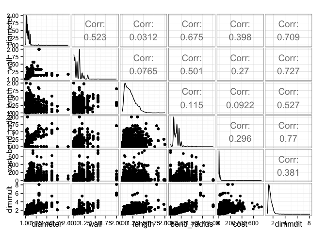

# Exploratory Analysis
Brad Dixon <rd729c@att.com>  
July 15, 2015  


# Primary Training Data


```r
DATA = bind_rows(
  mutate(train.set, dataset = "TRAIN", id = NA),
  mutate(test.set,  dataset = "TEST")
) %>% 
  mutate_each( funs(factor), tube_assembly_id, supplier, dataset) %>% 
  mutate( quote_date = ymd(quote_date))
```

```
## Warning in rbind_all(list(x, ...)): Unequal factor levels: coercing to
## character
```

```
## Warning in rbind_all(list(x, ...)): Unequal factor levels: coercing to
## character
```

```
## Warning in rbind_all(list(x, ...)): Unequal factor levels: coercing to
## character
```

```r
print(summary(DATA))
```

```
##  tube_assembly_id    supplier       quote_date                 
##  TA-04788:   14   S-0066 :41100   Min.   :1982-09-22 00:00:00  
##  TA-04027:   12   S-0041 : 6451   1st Qu.:2012-10-24 00:00:00  
##  TA-04750:   12   S-0072 : 4653   Median :2013-07-01 00:00:00  
##  TA-06069:   12   S-0054 : 1799   Mean   :2012-08-04 00:24:12  
##  TA-14402:   12   S-0026 : 1511   3rd Qu.:2013-09-01 00:00:00  
##  TA-04749:   11   S-0013 : 1166   Max.   :2017-01-01 00:00:00  
##  (Other) :60375   (Other): 3768                                
##   annual_usage     min_order_quantity bracket_pricing    quantity      
##  Min.   :      0   Min.   :   0.000   No : 7886       Min.   :   1.00  
##  1st Qu.:      0   1st Qu.:   0.000   Yes:52562       1st Qu.:   2.00  
##  Median :      0   Median :   0.000                   Median :  10.00  
##  Mean   :    186   Mean   :   2.191                   Mean   :  38.17  
##  3rd Qu.:      2   3rd Qu.:   0.000                   3rd Qu.:  40.00  
##  Max.   :3498645   Max.   :2500.000                   Max.   :2500.00  
##                                                                        
##       cost           dataset            id       
##  Min.   :   0.504   TEST :30235   Min.   :    1  
##  1st Qu.:   3.878   TRAIN:30213   1st Qu.: 7560  
##  Median :   6.521                 Median :15118  
##  Mean   :  13.433                 Mean   :15118  
##  3rd Qu.:  13.432                 3rd Qu.:22676  
##  Max.   :1000.000                 Max.   :30235  
##  NA's   :30235                    NA's   :30213
```


```r
# DATA %>% 
#   filter(dataset == "TRAIN" ) %>% 
#   select( annual_usage, min_order_quantity, bracket_pricing, quantity, cost ) %>% 
#   mutate(
#     nzmoq = min_order_quantity > 0,
#     nzau = annual_usage > 0
#   ) %>% 
#   ggpairs(
#     lower=list(continuous="smooth", params=c(colour="blue") ),
#     diag=list(continuous="bar", params=c(colour="blue", fill="blue")),
#     upper=list(params=c(colour="blue", fill="blue"))
#   ) %>% 
#   print
```

## Quotes from Multiple Suppliers


```r
DATA %>% 
  filter(dataset=="TRAIN") %>% 
  group_by(tube_assembly_id) %>% 
  summarize(
    num_suppliers = length(unique(supplier))
  ) %>% 
  filter( num_suppliers > 1) %>% 
  arrange( desc(num_suppliers))
```

```
## Source: local data frame [53 x 2]
## 
##    tube_assembly_id num_suppliers
## 1          TA-00140             2
## 2          TA-00199             2
## 3          TA-00434             2
## 4          TA-01241             2
## 5          TA-01329             2
## 6          TA-01369             2
## 7          TA-01597             2
## 8          TA-02227             2
## 9          TA-02308             2
## 10         TA-02601             2
## ..              ...           ...
```

* Some tube assemblies have quotes from multiple suppliers.


```r
DATA %>% 
  filter(dataset=="TRAIN") %>% 
  group_by(tube_assembly_id, quote_date) %>% 
  summarize(
    num_suppliers = length(unique(supplier))
  ) %>% 
  filter( num_suppliers > 1) %>% 
  arrange( desc(num_suppliers))
```

```
## Source: local data frame [1 x 3]
## Groups: tube_assembly_id
## 
##   tube_assembly_id quote_date num_suppliers
## 1         TA-08627 2009-08-31             2
```

* This seems due to shifting suppliers and not competitive bidding with one exception.


```r
filter(DATA, tube_assembly_id=="TA-08627")
```

```
## Source: local data frame [2 x 10]
## 
##   tube_assembly_id supplier quote_date annual_usage min_order_quantity
## 1         TA-08627   S-0014 2009-08-31          371                 25
## 2         TA-08627   S-0066 2009-08-31            2                 25
## Variables not shown: bracket_pricing (fctr), quantity (int), cost (dbl),
##   dataset (fctr), id (int)
```

* Note the difference in `annual_usage`.

## Tubes Quoted by Supplier


```r
DATA %>% 
  filter(dataset=="TRAIN") %>% 
  group_by( supplier ) %>% 
  summarize(
    num_tubes = length(unique(tube_assembly_id))
  ) %>% 
  filter( num_tubes > 1) %>% 
  arrange( desc(num_tubes ))
```

```
## Source: local data frame [40 x 2]
## 
##    supplier num_tubes
## 1    S-0066      3530
## 2    S-0041      1536
## 3    S-0072      1459
## 4    S-0026       552
## 5    S-0013       535
## 6    S-0058       252
## 7    S-0064       195
## 8    S-0062       176
## 9    S-0054       152
## 10   S-0030       103
## ..      ...       ...
```

* Suppliers provide multiple types of tubes.

## Repeated Quotes over Time


```r
DATA %>% 
  filter(dataset=="TRAIN") %>% 
  group_by( tube_assembly_id, supplier ) %>% 
  summarize(
    num_quote_dates = length(unique(quote_date))
  ) %>% 
  filter( num_quote_dates > 1 ) %>% 
  arrange( desc(num_quote_dates) )
```

```
## Source: local data frame [225 x 3]
## Groups: tube_assembly_id
## 
##    tube_assembly_id supplier num_quote_dates
## 1          TA-00034   S-0062               2
## 2          TA-00114   S-0072               2
## 3          TA-00140   S-0066               2
## 4          TA-00178   S-0072               2
## 5          TA-00199   S-0072               2
## 6          TA-00204   S-0072               2
## 7          TA-00206   S-0072               2
## 8          TA-00325   S-0072               2
## 9          TA-00375   S-0072               2
## 10         TA-00408   S-0072               2
## ..              ...      ...             ...
```

* Occassional re-quotes on different dates by a supplier

## Supplier and Tube Overlap Between Train and Test


```r
DATA %>% 
  group_by( supplier, tube_assembly_id ) %>% 
  summarize(
    test = sum(which(dataset=="TEST")),
    train = sum(which(dataset=="TRAIN"))
  ) %>% 
  filter( test>0, train>0)
```

```
## Source: local data frame [0 x 4]
## Groups: supplier
## 
## Variables not shown: supplier (fctr), tube_assembly_id (fctr), test (int),
##   train (int)
```

* No overlap between test and train on a supplier and tube basis. We must use the attributes of the tube to predict the cost.


```r
DATA %>% 
  group_by( supplier ) %>% 
  summarize(
    test = length(which(dataset=="TEST")),
    train = length(which(dataset=="TRAIN"))
  ) %>% 
  filter( test>0, train>0 ) %>% 
  arrange(desc(train))
```

```
## Source: local data frame [45 x 3]
## 
##    supplier  test train
## 1    S-0066 20547 20553
## 2    S-0041  3128  3323
## 3    S-0072  2336  2317
## 4    S-0054   961   838
## 5    S-0026   784   727
## 6    S-0013   612   554
## 7    S-0058   523   516
## 8    S-0064   444   446
## 9    S-0062   232   264
## 10   S-0014   124   139
## ..      ...   ...   ...
```

* Significant number of quotes from vendors present in both test and train.


```r
DATA %>% 
  group_by( tube_assembly_id ) %>% 
  summarize(
    test = length(which(dataset=="TEST")),
    train = length(which(dataset=="TRAIN"))
  ) %>% 
  filter( test>0, train>0 ) %>% 
  arrange(desc(train))
```

```
## Source: local data frame [0 x 3]
## 
## Variables not shown: tube_assembly_id (fctr), test (int), train (int)
```

* But tubes are not present in both test and train. Got to use the tube characteristics to make a prediction.

## Bracket Pricing Cost vs. Quantity


```r
BRACKET_DISCOUNT = DATA %>% 
  filter(
    dataset=="TRAIN",
    bracket_pricing=="Yes"
  ) %>% 
  group_by( tube_assembly_id, supplier, quote_date ) %>% 
  mutate(
    cost_fraction = cost / max(cost)
  ) %>% 
  select( quantity, cost, cost_fraction) %>% 
  print
```

```
## Source: local data frame [26,283 x 6]
## Groups: tube_assembly_id, supplier, quote_date
## 
##    tube_assembly_id supplier quote_date quantity      cost cost_fraction
## 1          TA-00002   S-0066 2013-07-07        1 21.905933     1.0000000
## 2          TA-00002   S-0066 2013-07-07        2 12.341214     0.5633731
## 3          TA-00002   S-0066 2013-07-07        5  6.601826     0.3013716
## 4          TA-00002   S-0066 2013-07-07       10  4.687770     0.2139954
## 5          TA-00002   S-0066 2013-07-07       25  3.541561     0.1616713
## 6          TA-00002   S-0066 2013-07-07       50  3.224406     0.1471933
## 7          TA-00002   S-0066 2013-07-07      100  3.082521     0.1407163
## 8          TA-00002   S-0066 2013-07-07      250  2.999060     0.1369063
## 9          TA-00004   S-0066 2013-07-07        1 21.972702     1.0000000
## 10         TA-00004   S-0066 2013-07-07        2 12.407983     0.5646999
## ..              ...      ...        ...      ...       ...           ...
```

```r
ggplot( BRACKET_DISCOUNT, aes( quantity, cost_fraction) ) +
  geom_point()
```

 

## Date


```r
DATA %>% 
  group_by( year=year(quote_date), dataset ) %>% 
  summarize( num_quotes = n ()) %>% 
  ggplot(aes(year, num_quotes, color=dataset) ) +
    geom_line()
```

 


```r
DATA %>% 
  group_by( quarter=factor(quarter(quote_date)), dataset ) %>% 
  summarize( num_quotes = n ()) %>% 
  ggplot(aes(quarter, num_quotes, fill=quarter) ) +
    geom_bar(stat="identity") +
    facet_grid( ~ dataset )
```

 

# Supplemental Data

## BOM


```r
print(glimpse(BOM))
```

```
## Observations: 39459
## Variables:
## $ tube_assembly_id (fctr) TA-00001, TA-00002, TA-00003, TA-00004, TA-0...
## $ component        (fctr) C-1622, C-1312, C-1312, C-1312, C-1624, C-16...
## $ quantity         (int) 2, 2, 2, 2, 1, 1, 2, 2, 2, 2, 2, 2, 1, 2, 2, ...
## NULL
```

```r
BOMSUMMARY = BOM %>% 
  group_by( tube_assembly_id ) %>% 
  summarize(
    num_components = n(),
    num_parts = sum(quantity)
  )
print(summary(BOM))
```

```
##  tube_assembly_id   component        quantity    
##  TA-11524:    8   C-1621 : 2114   Min.   :1.000  
##  TA-03470:    7   C-1628 : 2103   1st Qu.:1.000  
##  TA-03665:    7   C-1629 : 1965   Median :1.000  
##  TA-13051:    7   C-1622 : 1933   Mean   :1.472  
##  TA-14177:    7   C-1624 : 1585   3rd Qu.:2.000  
##  TA-18208:    7   C-1631 : 1569   Max.   :6.000  
##  (Other) :39416   (Other):28190
```

```r
DATA %>% 
  filter( dataset=="TRAIN" ) %>% 
  select( tube_assembly_id, cost ) %>% 
  left_join( BOMSUMMARY ) %>% 
  ggplot( aes( num_parts, log(cost+1)) ) +
    geom_point( colour = "blue" ) +
    geom_smooth()
```

```
## Joining by: "tube_assembly_id"
```

```
## Warning in left_join_impl(x, y, by$x, by$y): joining factors with different
## levels, coercing to character vector
```

```
## Warning in loop_apply(n, do.ply): Removed 1462 rows containing missing
## values (stat_smooth).
```

```
## Warning in loop_apply(n, do.ply): Removed 1462 rows containing missing
## values (geom_point).
```

 

## TUBE


```r
print(glimpse(TUBE))
```

```
## Observations: 21198
## Variables:
## $ tube_assembly_id (fctr) TA-00001, TA-00002, TA-00003, TA-00004, TA-0...
## $ material_id      (fctr) SP-0035, SP-0019, SP-0019, SP-0019, SP-0029,...
## $ diameter         (dbl) 12.70, 6.35, 6.35, 6.35, 19.05, 19.05, 12.70,...
## $ wall             (dbl) 1.650, 0.710, 0.710, 0.710, 1.240, 1.240, 1.6...
## $ length           (dbl) 164, 137, 127, 137, 109, 79, 202, 174, 135, 2...
## $ num_bends        (int) 5, 8, 7, 9, 4, 4, 5, 6, 4, 4, 7, 7, 3, 4, 6, ...
## $ bend_radius      (dbl) 38.10, 19.05, 19.05, 19.05, 50.80, 50.80, 38....
## $ end_a_1x         (fctr) N, N, N, N, N, N, N, N, N, N, N, N, N, N, N,...
## $ end_a_2x         (fctr) N, N, N, N, N, N, N, N, N, N, N, N, N, N, N,...
## $ end_x_1x         (fctr) N, N, N, N, N, N, N, N, N, N, N, N, N, N, N,...
## $ end_x_2x         (fctr) N, N, N, N, N, N, N, N, N, N, N, N, N, N, N,...
## $ end_a            (fctr) EF-003, EF-008, EF-008, EF-008, EF-003, EF-0...
## $ end_x            (fctr) EF-003, EF-008, EF-008, EF-008, EF-003, EF-0...
## $ num_boss         (int) 0, 0, 0, 0, 0, 0, 0, 0, 0, 0, 0, 0, 1, 0, 0, ...
## $ num_bracket      (int) 0, 0, 0, 0, 0, 0, 0, 0, 0, 0, 0, 0, 0, 0, 0, ...
## $ other            (int) 0, 0, 0, 0, 0, 0, 0, 0, 0, 0, 0, 0, 0, 0, 0, ...
## $ spec1            (fctr) NA, NA, NA, NA, NA, NA, NA, NA, NA, NA, NA, ...
## $ spec2            (fctr) NA, NA, NA, NA, NA, NA, NA, NA, NA, NA, NA, ...
## $ spec3            (fctr) NA, NA, NA, NA, NA, NA, NA, NA, NA, NA, NA, ...
## $ spec4            (fctr) NA, NA, NA, NA, NA, NA, NA, NA, NA, NA, NA, ...
## $ spec5            (fctr) NA, NA, NA, NA, NA, NA, NA, NA, NA, NA, NA, ...
## $ spec6            (fctr) NA, NA, NA, NA, NA, NA, NA, NA, NA, NA, NA, ...
## $ spec7            (fctr) NA, NA, NA, NA, NA, NA, NA, NA, NA, NA, NA, ...
## $ spec8            (fctr) NA, NA, NA, NA, NA, NA, NA, NA, NA, NA, NA, ...
## $ spec9            (fctr) NA, NA, NA, NA, NA, NA, NA, NA, NA, NA, NA, ...
## $ spec10           (fctr) NA, NA, NA, NA, NA, NA, NA, NA, NA, NA, NA, ...
## $ forming_a        (fctr) No, Yes, Yes, Yes, No, No, No, Yes, No, No, ...
## $ forming_x        (fctr) No, Yes, Yes, Yes, No, No, No, Yes, No, No, ...
## NULL
```

```r
print(summary(TUBE))
```

```
##  tube_assembly_id  material_id       diameter           wall      
##  TA-00001:    1   SP-0029:11488   Min.   :  3.18   Min.   :0.710  
##  TA-00002:    1   SP-0035: 3676   1st Qu.:  9.52   1st Qu.:0.890  
##  TA-00003:    1   SP-0028: 1644   Median : 15.88   Median :1.650  
##  TA-00004:    1   SP-0039:  970   Mean   : 23.69   Mean   :1.578  
##  TA-00005:    1   SP-0019:  926   3rd Qu.: 25.40   3rd Qu.:1.650  
##  TA-00006:    1   (Other): 2215   Max.   :203.20   Max.   :7.900  
##  (Other) :21192   NA's   :  279                                   
##      length         num_bends       bend_radius      end_a_1x  end_a_2x 
##  Min.   :   0.0   Min.   : 0.000   Min.   :   0.00   N:20118   N:18015  
##  1st Qu.:  48.0   1st Qu.: 2.000   1st Qu.:  19.05   Y: 1080   Y: 3183  
##  Median :  86.0   Median : 3.000   Median :  38.10                      
##  Mean   : 100.3   Mean   : 3.748   Mean   :  49.35                      
##  3rd Qu.: 135.0   3rd Qu.: 5.000   3rd Qu.:  50.80                      
##  Max.   :1333.0   Max.   :17.000   Max.   :9999.00                      
##                                                                         
##  end_x_1x  end_x_2x      end_a           end_x          num_boss      
##  N:20377   N:18493   EF-003 :11388   EF-003 :10863   Min.   :0.00000  
##  Y:  821   Y: 2705   EF-018 : 2514   EF-018 : 2287   1st Qu.:0.00000  
##                      EF-008 : 2130   EF-017 : 2022   Median :0.00000  
##                      EF-017 : 1052   EF-008 : 1947   Mean   :0.04448  
##                      NONE   :  998   NONE   : 1375   3rd Qu.:0.00000  
##                      EF-009 :  878   EF-009 :  829   Max.   :5.00000  
##                      (Other): 2238   (Other): 1875                    
##   num_bracket           other             spec1           spec2      
##  Min.   :0.000000   Min.   :0.00000   SP-0007: 3002   SP-0012: 1736  
##  1st Qu.:0.000000   1st Qu.:0.00000   SP-0063: 1319   SP-0024:  915  
##  Median :0.000000   Median :0.00000   SP-0012:  808   SP-0080:  855  
##  Mean   :0.006746   Mean   :0.02264   SP-0004:  637   SP-0069:  683  
##  3rd Qu.:0.000000   3rd Qu.:0.00000   SP-0058:  379   SP-0070:  633  
##  Max.   :5.000000   Max.   :8.00000   (Other):  984   (Other): 2022  
##                                       NA's   :14069   NA's   :14354  
##      spec3           spec4           spec5           spec6      
##  SP-0080: 1798   SP-0026: 1492   SP-0080: 1780   SP-0082: 1167  
##  SP-0024: 1521   SP-0080: 1150   SP-0026:  378   SP-0080:  569  
##  SP-0026:  797   SP-0024:  395   SP-0082:  323   SP-0088:  193  
##  SP-0070:  302   SP-0082:  324   SP-0050:   98   SP-0079:   54  
##  SP-0022:  246   SP-0063:  145   SP-0079:   65   SP-0063:   13  
##  (Other): 1176   (Other):  648   (Other):  277   (Other):   75  
##  NA's   :15358   NA's   :17044   NA's   :18277   NA's   :19127  
##      spec7           spec8           spec9           spec10     
##  SP-0082:  322   SP-0062:    1   SP-0070:    1   SP-0080:    1  
##  SP-0080:  116   SP-0080:    7   SP-0082:    1   NA's   :21197  
##  SP-0088:   80   SP-0082:   73   SP-0088:   18                  
##  SP-0083:    4   SP-0088:   25   NA's   :21178                  
##  SP-0070:    3   NA's   :21092                                  
##  (Other):   10                                                  
##  NA's   :20663                                                  
##  forming_a    forming_x   
##  No  :13392   No  :12420  
##  Yes : 6808   Yes : 7403  
##  NA's:  998   NA's: 1375  
##                           
##                           
##                           
## 
```

```r
table(TUBE$bend_radius>360)
```

```
## 
## FALSE  TRUE 
## 21184    14
```

```r
TUBE %>%
  group_by(num_bends) %>% 
  summarise_each( funs(min, mean, max), bend_radius)
```

```
## Source: local data frame [18 x 4]
## 
##    num_bends   min     mean     max
## 1          0  0.00  0.00000    0.00
## 2          1 12.70 83.19105 9999.00
## 3          2  3.75 65.17378 9999.00
## 4          3 12.70 51.68872 9999.00
## 5          4  4.00 45.10190  254.00
## 6          5 12.70 40.69751  254.00
## 7          6  9.53 36.73016  451.00
## 8          7 12.70 33.26519  338.10
## 9          8 12.70 30.46513  152.40
## 10         9 12.70 28.10237   80.00
## 11        10 12.70 27.34173   80.00
## 12        11 12.70 30.41014   70.00
## 13        12 19.05 30.63537   90.00
## 14        13 19.00 24.00714   63.50
## 15        14 19.05 22.87273   38.10
## 16        15 19.05 22.22500   31.75
## 17        16 19.00 19.18333   19.50
## 18        17 19.05 19.05000   19.05
```

```r
table(cut(TUBE$bend_radius, 10))
```

```
## 
##   (-10,1e+03] (1e+03,2e+03] (2e+03,3e+03] (3e+03,4e+03] (4e+03,5e+03] 
##         21190             0             0             0             0 
## (5e+03,6e+03] (6e+03,7e+03] (7e+03,8e+03] (8e+03,9e+03] (9e+03,1e+04] 
##             0             0             0             0             8
```

```r
table(TUBE$num_bends)
```

```
## 
##    0    1    2    3    4    5    6    7    8    9   10   11   12   13   14 
##  819 1729 5030 3316 3614 2313 1809 1130  675  388  231   69   41   14   11 
##   15   16   17 
##    4    3    2
```

```r
table(TUBE$num_boss)
```

```
## 
##     0     1     2     3     4     5 
## 20461   583   112    34     6     2
```

```r
table(TUBE$num_bracket)
```

```
## 
##     0     1     2     3     4     5 
## 21079   102    13     2     1     1
```

```r
table(TUBE$other)
```

```
## 
##     0     1     2     3     4     5     6     8 
## 20831   290    61     7     3     3     2     1
```

* `bend_radius`: There are some really bendy tubes! Looks like an alias to NA or an off scale value.
* `end_a` and `end_x`: `NONE` should be `NA`.
* `num_bends`, `num_boss`, `num_bracket`, `other` should be treated as categorical (factors).
* `length` has an outlier with a value 1333.


```r
DATA %>% 
  filter( dataset == "TRAIN", min_order_quantity==0 ) %>% 
  left_join(TUBE) %>% 
  select( diameter, wall, length, bend_radius, cost ) %>% 
  # Trim some outliers
  filter(
    bend_radius < 500,
    length < 1000
  ) %>% 
  # Lets be funky and multiply these physical measurements together
  mutate_each( funs(rescale(., c(1,2))), diameter, wall, length, bend_radius) %>% 
  mutate(
    dimmult = diameter * wall * length * bend_radius
  ) %>% 
  ggpairs
```

```
## Joining by: "tube_assembly_id"
```

```
## Warning in left_join_impl(x, y, by$x, by$y): joining factors with different
## levels, coercing to character vector
```

 

# Benchmark Comparison

## RF Benchmark

From the [0.2748 with RF and log transformation
](https://www.kaggle.com/ademyttenaere/caterpillar-tube-pricing/0-2748-with-rf-and-log-transformation/code) script.


```r
COMP = rf.benchmark %>% 
  tbl_df %>% 
  rename(benchmark=cost) %>% 
  mutate(
    sub_rf_20150718_1 = read.csv("reports/submission_rf_20150718_RF-3-ge16d7f8-dirty.csv")[,2],
    sub_rf_20150718_2 = read.csv("reports/submission_rf_20150718_RF-8-g53a7563-dirty.csv")[,2]
  ) %>% 
  mutate_each( funs( log(.+1) - log(benchmark+1) ), starts_with("sub_")) %>% 
  gather( metric, value, -id, -benchmark )

COMP %>% 
  ggplot( aes( benchmark, value, color=metric )) +
    geom_point(size=1) +
    geom_smooth() +
    geom_hline(yintercept=0, color="black") +
    xlab("Cost estimated by benchmark") +
    ylab("Difference in log transformed price: predicted - benchmark") +
    ggtitle("Model vs. RF Benchmark from Forum")
```

 
